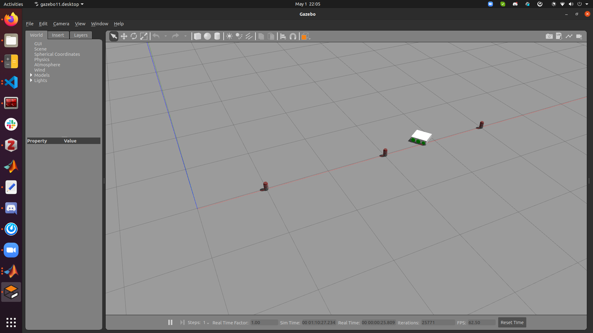

# auto-mobile-robot

## What is this?

This is a software repository for developing an autonomous mobile robot. Unlike the sister repository, [remote-controlled-robot](), this repository focuses more on autonomy rather than internet communication / docker / UI.

## Robot in Action
See the robot completing the slalom course in this [video](https://youtu.be/ndz-hawqSLs)  

### Current Work
- Trajectory Generation / Planning
- System ID
- Control
- Mapping

## Robot Configuration

The [six-wheel-robot](https://github.com/jkleiber/six-wheel-robot) is equipped with a YDLIDAR X4 and a Jetson Nano.

